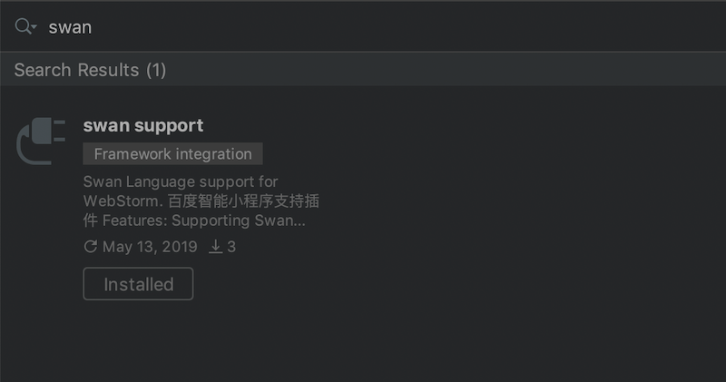
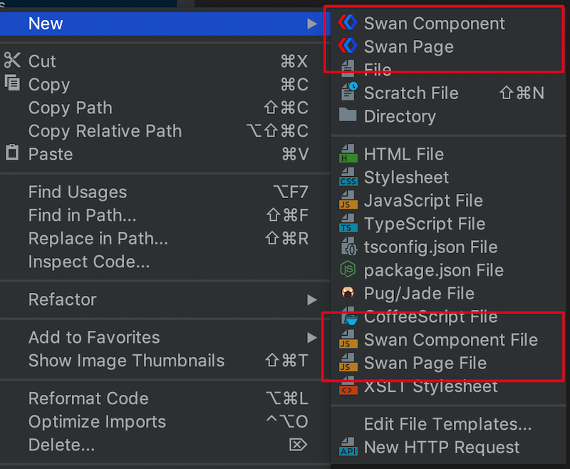
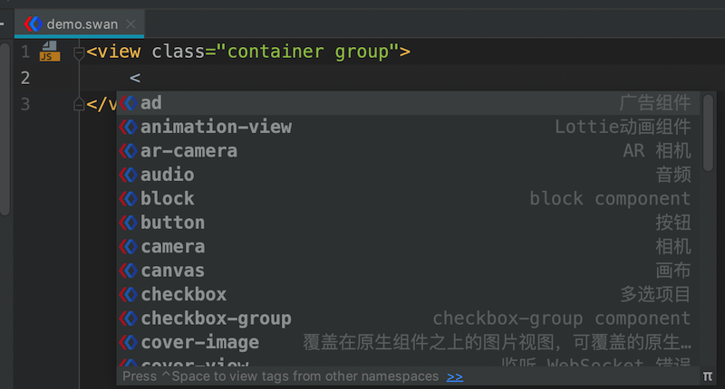
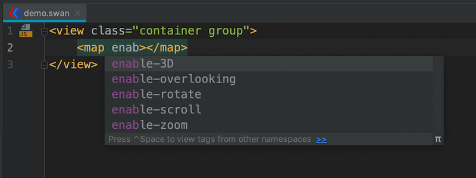
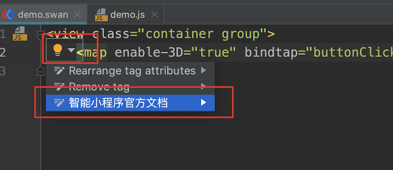
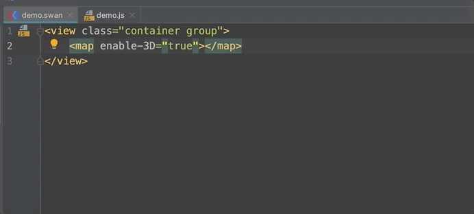
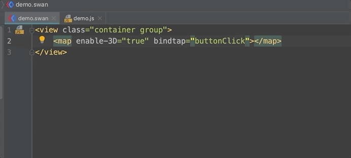
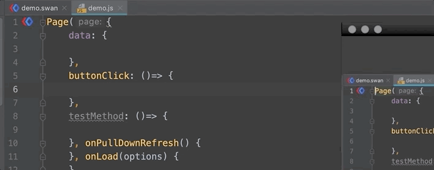
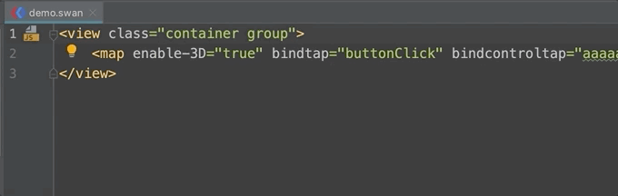
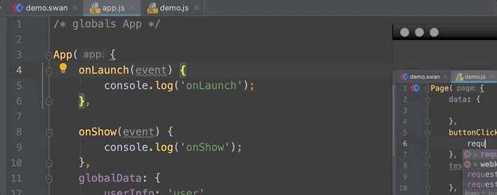

# SwanDevPlugin

baidu smart app dev plugin for WebStorm IDE 百度智能小程序 WebStorm 智能提醒插件

## Feature：
* 支持智能小程序项目创建
* 支持智能小程序组件和属性智能提醒和内容校验
* 支持智能小程序方法和参数提醒
* 支持swan文件和JS文件互相切换和变量和方法智能提取
* 更多强大的功能欢迎下载体验~

## QuickStart
[下载插件](./downloads) 或 WebStorm 插件中心搜索 `swan`

## Preview
* 创建新项目
 

* 新的页面和组件模板
 

* 组件提醒
 

* 属性提醒
 

* 跳转官方文档
 

* 选择对应JS文件的方法和引用跳转
 

* swan属性直接创建方法
 

* api 模板

 

* 左上角swan和对应JS文件互相跳转
 

* 重写父类方法 

 

* 参数智能提醒 

 

更多文档待补充~

## Todo
* 支持变量层级调用的引用跳转，如`{{a.b.c}}`
* 支持`s-for`的引用提醒和跳转
* ~~屏蔽 style中包含变量的错误提醒~~
* 屏蔽 `s-else`, `checked` 等空属性的警告
* 支持 `app.json`等配置文件自动提醒
* 更多功能扩展欢迎提 issue 和 pr

## Document
- [Intellij IDEA插件开发（五）自定义语言支持](http://ju.outofmemory.cn/entry/322656)
- [vscode-swan](https://github.com/efe-blue/vscode-swan)
- [WePY 插件](http://wepy.iniself.com/)
- [weapp-support-plugin](https://github.com/kerlw/weapp-support-plugin/)

## License
<pre>
Licensed under the Apache License, Version 2.0 (the "License");
you may not use this file except in compliance with the License.
You may obtain a copy of the License at

   http://www.apache.org/licenses/LICENSE-2.0

Unless required by applicable law or agreed to in writing, software
distributed under the License is distributed on an "AS IS" BASIS,
WITHOUT WARRANTIES OR CONDITIONS OF ANY KIND, either express or implied.
See the License for the specific language governing permissions and
limitations under the License.
</pre>